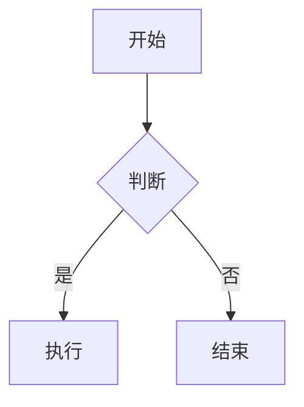

<h1 align="center">Markdown Nice</h1>

## 简介

一款支持自定义样式的 Markdown 编辑器，专注于微信公众号排版，让排版变简单。

本项目基于 [whaoa/markdown-nice](https://github.com/whaoa/markdown-nice) 进行二次开发，感谢原项目及 [mdnice/markdown-nice](https://github.com/mdnice/markdown-nice) 所有贡献者。

## 功能特性

- Markdown 实时编辑与预览
- 内置 20+ 排版主题，一键切换
- 代码高亮，默认 **atom-one-dark** 风格，支持 Mac 风格代码块
- 支持数学公式（KaTeX / MathJax）
- 支持 Mermaid 图表（流程图、时序图等），复制时自动转为 PNG 图片
- 支持图片上传（阿里 OSS、七牛）
- 一键复制到微信公众号编辑器

## 主题

内置多款精选主题，可在编辑器页面顶部主题菜单中切换：

| 主题 | 作者 | 说明 |
|------|------|------|
| 默认主题 | @zhning12 | |
| 山吹 | @ElyhG | |
| 蔷薇紫 | @HeyRain | |
| 全栈蓝 | @Nealyang | |
| 凝夜紫 | @童欧巴 | 适配深色模式 |
| 萌绿 | @koala | |
| 极简黑 | @小鱼 | |
| 橙心 | @zhning12 | |
| 墨黑 | @Mayandev | |
| 姹紫 | @djmaxwow | |
| 绿意 | @夜尽天明 | |
| 嫩青 | @画手 | |
| WeChat-Format | @画手 | |
| 兰青 | @Krahets | |
| 前端之巅同款 | @HeyRain | |
| 极客黑 | @hyper-xx | |
| 红绯 | @HeyRain | |
| 蓝莹 | @谭淞宸 | |
| 科技蓝 | @夜尽天明 | |
| 简 | @aco | |

## 快速开始

```bash
# 安装依赖
npm install

# 启动开发服务
npm start

# 构建生产版本
npm run build
```

## Mermaid 图表

支持在编辑器中使用 mermaid 代码块渲染图表，复制到微信/知乎/掘金时自动转为 PNG 图片。

````markdown

````

支持的图表类型：流程图、时序图、甘特图、类图、状态图、饼图等。

## 技术栈

- React 16
- MobX 5
- markdown-it
- Mermaid 8
- CodeMirror
- Webpack 4

## 致谢

- [mdnice/markdown-nice](https://github.com/mdnice/markdown-nice) - 原始项目
- [whaoa/markdown-nice](https://github.com/whaoa/markdown-nice) - 上游项目

## 许可证

[GPL-3.0](LICENSE)
